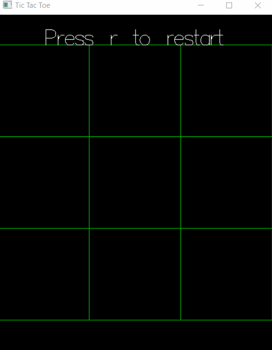

# Tic-Tac-Toe Minimax Haskell

A basic tic tac toe game (along with the minimax AI algorithm) implemented in Haskell.

To run this package you'll need to:

1. Install the [Haskell Platform](https://www.haskell.org/platform/) which includes GHC, Cabal and Stack build tools.
2. Clone the repo
3. enter `stack run` on the project directory

Preview:

